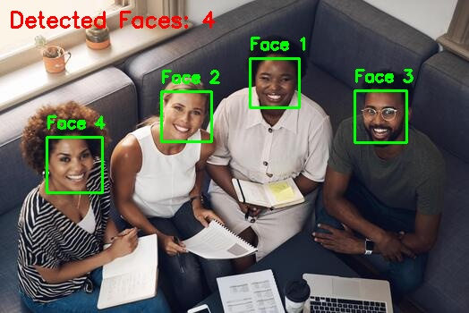
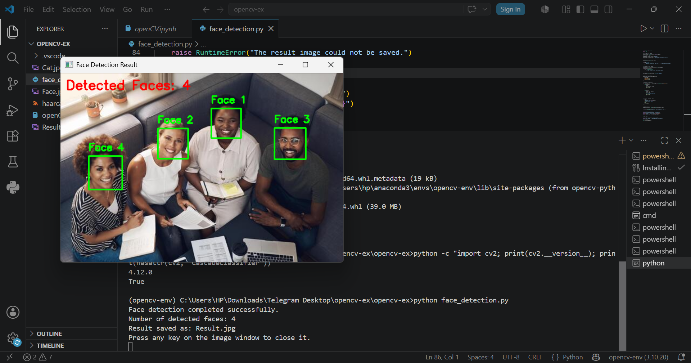

# Face Detection Using OpenCV

## Project Overview

This project uses OpenCV to detect human faces in an image.

The program loads a group image, converts it to grayscale, detects the faces using a Haar Cascade classifier, draws a rectangle around each detected face, and saves the final result as a new image.

> This project performs face detection. It detects the location of faces but does not identify people by name.

## Project Objective

The objective of this project is to apply computer vision techniques using Python and OpenCV to:

- Read an input image.
- Detect human faces.
- Draw rectangles around the detected faces.
- Count the number of detected faces.
- Save and display the final result.

## Tools and Technologies

- Python 3.10
- OpenCV
- Anaconda
- Visual Studio Code
- Haar Cascade Classifier
- GitHub

## Project Files

- `face_detection.py`: The main Python script.
- `Face.jpg`: The original input image.
- `haarcascade_frontalface_default.xml`: The Haar Cascade model used to detect frontal faces.
- `Result.jpg`: The image generated after detecting the faces.
- `Screenshot.png`: Screenshot showing the program output.
- `requirements.txt`: Contains the required Python library.

## How the Project Works

1. The program loads the input image using OpenCV.
2. It converts the image from color to grayscale.
3. It loads the Haar Cascade face detection model.
4. The model searches for faces in the grayscale image.
5. A green rectangle and label are drawn around each detected face.
6. The total number of detected faces is displayed.
7. The final image is saved as `Result.jpg`.

## Installation and Setup

### 1. Create an Anaconda Environment

Open Anaconda Prompt and run:

```bash
conda create -n opencv-env python=3.10
```

Activate the environment:

```bash
conda activate opencv-env
```

### 2. Install the Required Library

Install the required library using:

```bash
pip install -r requirements.txt
```

Alternatively, install OpenCV directly:

```bash
pip install opencv-python
```

### 3. Open the Project

Open the project folder using Visual Studio Code.

Make sure that all project files are located in the same folder.

### 4. Run the Program

Open the terminal in Visual Studio Code and run:

```bash
python face_detection.py
```

## Expected Output

The program will:

- Detect the faces in `Face.jpg`.
- Draw a green rectangle around each face.
- Display the number of detected faces in the terminal.
- Save the processed image as `Result.jpg`.

Example terminal output:

```text
Face detection completed successfully.
Number of detected faces: 4
Result saved as: Result.jpg
```

## Result

The following image shows the result after detecting the faces:



## Execution Screenshot

The following screenshot shows the program execution:



## Conclusion

This project demonstrates how OpenCV and the Haar Cascade classifier can be used to detect multiple human faces in an image. It also shows the basic steps of image reading, grayscale conversion, face detection, drawing rectangles, and saving the processed image.

## Author

Developed as part of the Artificial Intelligence and Robotics training program at Smart Methods.
